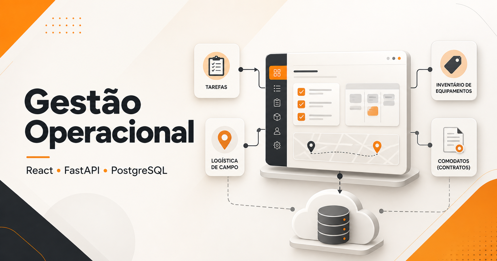
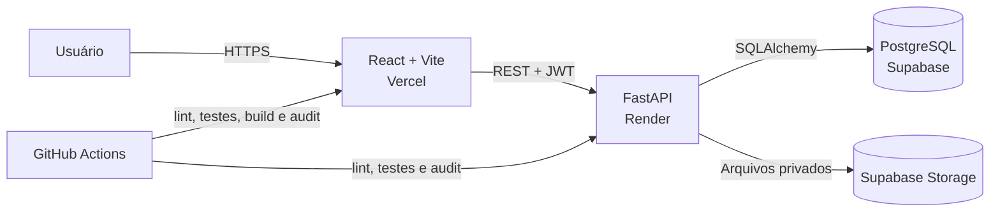

# Gestão Operacional

[](https://github.com/KennnedyRamos/gestao_de_tarefas/actions/workflows/ci.yml)
[](https://react.dev/)
[](https://fastapi.tiangolo.com/)
[](https://supabase.com/)
[](LICENSE)



Plataforma full stack para centralizar tarefas, rotinas, entregas, retiradas, comodatos e inventário de equipamentos. O projeto nasceu de um problema operacional real: informações distribuídas, consultas lentas e pouca rastreabilidade entre o cliente, o equipamento e sua movimentação.

- **Aplicação:** [gestao-de-tarefas-nine.vercel.app](https://gestao-de-tarefas-nine.vercel.app/)
- **API:** [gestao-de-tarefas-backend.onrender.com/health](https://gestao-de-tarefas-backend.onrender.com/health)
- **Documentação da API:** [Swagger UI](https://gestao-de-tarefas-backend.onrender.com/docs)

> A aplicação é um ambiente operacional protegido: as telas e os dados exigem autenticação e permissões apropriadas. Nenhuma credencial de produção é publicada neste repositório.

## O problema que o projeto resolve

Uma operação de campo precisa responder rapidamente a perguntas como:

- quais tarefas e rotinas estão pendentes;
- quais entregas e retiradas estão programadas;
- qual equipamento está vinculado a determinado cliente;
- quais comodatos pertencem ao cliente encontrado por código, modelo, RG ou etiqueta;
- quais usuários podem consultar ou alterar cada módulo.

A plataforma reúne esses fluxos em uma única interface responsiva, com autenticação, autorização granular, histórico operacional e persistência em nuvem.

## Destaques técnicos

- **Busca global no banco:** equipamento, modelo, marca, RG, etiqueta, observação e código do cliente são pesquisados no backend. Ao localizar um item, a consulta retorna os comodatos abertos do cliente relacionado, sem ficar limitada ao mês selecionado, e prioriza visualmente o material que originou a correspondência.
- **Consultas mais eficientes:** filtros normais de competência são aplicados no SQL, resultados extensos usam paginação e o campo de pesquisa utiliza debounce para evitar requisições a cada tecla.
- **Preenchimento consistente de clientes:** a consulta por código respeita as permissões de todos os fluxos que dependem do catálogo, evitando telas vazias para usuários autorizados.
- **Controle de acesso:** autenticação JWT, perfis e permissões por funcionalidade, além de limitação de tentativas de login.
- **Arquivos protegidos:** validação de uploads e suporte a bucket privado no Supabase Storage.
- **Qualidade contínua:** lint, testes, build e auditoria de dependências executados pelo GitHub Actions.
- **Deploy desacoplado:** frontend, API, banco e arquivos podem escalar de forma independente.

## Arquitetura



### Stack

| Camada | Tecnologias |
| --- | --- |
| Frontend | React 18, Vite, Material UI, Axios, Day.js |
| Backend | Python 3.11, FastAPI, SQLAlchemy, Pydantic, JWT |
| Dados | PostgreSQL no Supabase |
| Arquivos | Supabase Storage privado |
| Qualidade | Pytest, Vitest, Testing Library, Ruff, ESLint, pip-audit, npm audit |
| Infraestrutura | Vercel, Render, Supabase e GitHub Actions |

## Funcionalidades

- painel de tarefas com prioridade, prazo e etiquetas;
- rotinas operacionais;
- entregas e anexos em PDF;
- retiradas, acompanhamento diário e geração de documentos;
- importação controlada das bases de clientes e inventário por CSV;
- gestão de refrigeradores e outros equipamentos;
- leitura de RG e etiqueta com suporte a OCR;
- busca de equipamentos e comodatos por múltiplos identificadores;
- sincronização do status de alocação;
- administração de usuários, perfis e permissões.

## Estrutura do repositório

```text
gestao_de_tarefas/
├── .github/workflows/ci.yml       # pipeline de qualidade
├── backend/
│   ├── app/
│   │   ├── core/                  # configuração e segurança
│   │   ├── database/              # sessão e metadata SQLAlchemy
│   │   ├── models/                # entidades persistidas
│   │   ├── routes/                # endpoints FastAPI
│   │   ├── schemas/               # contratos Pydantic
│   │   └── services/              # armazenamento e regras compartilhadas
│   ├── tests/                     # testes de integração da API
│   └── task-manager-frontend/
│       ├── public/                # assets públicos
│       └── src/                   # páginas, componentes e serviços React
├── render.yaml                    # infraestrutura do backend
└── README.md
```

## Executando localmente

### Pré-requisitos

- Python 3.11+
- Node.js 20.19+ ou 22.12+
- PostgreSQL acessível local ou remotamente

### 1. Backend

No PowerShell:

```powershell
cd backend
python -m venv .venv
.\.venv\Scripts\Activate.ps1
python -m pip install -r requirements-dev.txt
Copy-Item .env.example .env
uvicorn app.main:app --reload
```

Preencha no `.env`, no mínimo, `DATABASE_URL`, `SECRET_KEY`, `ADMIN_EMAIL` e `ADMIN_PASSWORD`. Gere uma chave forte, por exemplo:

```powershell
python -c "import secrets; print(secrets.token_urlsafe(48))"
```

A API estará em `http://localhost:8000` e o Swagger em `http://localhost:8000/docs`.

### 2. Frontend

Em outro terminal:

```powershell
cd backend\task-manager-frontend
npm ci
Copy-Item .env.example .env
npm run dev
```

Para desenvolvimento local, defina `VITE_API_URL=http://localhost:8000`. O frontend estará em `http://localhost:3000`.

## Variáveis de ambiente

Os exemplos completos estão em [`backend/.env.example`](backend/.env.example) e [`backend/task-manager-frontend/.env.example`](backend/task-manager-frontend/.env.example).

| Variável | Uso |
| --- | --- |
| `DATABASE_URL` | conexão PostgreSQL; use `postgresql://` ou `postgresql+psycopg2://` |
| `SECRET_KEY` | assinatura dos tokens JWT |
| `ADMIN_EMAIL` / `ADMIN_PASSWORD` | criação segura do primeiro administrador |
| `CORS_ORIGINS` / `CORS_ORIGIN_REGEX` | origens autorizadas no backend |
| `DB_BOOTSTRAP_MODE` | `sync` no deploy, `background` local ou `off` |
| `SUPABASE_URL` | URL do projeto Supabase |
| `SUPABASE_SERVICE_ROLE_KEY` | acesso do backend ao Storage; nunca exponha no frontend |
| `SUPABASE_STORAGE_BUCKET` | bucket privado para os documentos |
| `VITE_API_URL` | endereço público da API consumida pelo frontend |

Arquivos `.env`, credenciais, builds e uploads locais são ignorados pelo Git.

## Qualidade e testes

Execute a mesma validação usada no CI antes de abrir um pull request:

```powershell
cd backend
ruff check app
python -m compileall -q app
python -m pytest -q
python -m pip_audit -r requirements.txt --progress-spinner off

cd task-manager-frontend
npm run lint
npm test
npm run build
npm audit --omit=dev
```

## Deploy

### Supabase

1. Crie o projeto PostgreSQL e copie a string de conexão para `DATABASE_URL`.
2. Crie um bucket privado, por exemplo `deliveries`.
3. Mantenha a `service_role key` exclusivamente no backend.

### Render

O [`render.yaml`](render.yaml) declara o serviço FastAPI, a instalação das dependências e o health check em `/health/db`. Configure os segredos no painel do Render e mantenha `DB_BOOTSTRAP_MODE=sync`.

### Vercel

Use `backend/task-manager-frontend` como diretório raiz, defina `VITE_API_URL` com a URL do Render e publique. O `vercel.json` inclui o fallback de SPA, cache de assets versionados e cabeçalhos de segurança.

Pushes em `main` passam pelo CI e acionam as integrações de deploy conectadas ao repositório.

## Decisões e próximos passos

A versão atual prioriza uma entrega funcional, auditável e fácil de operar. Evoluções planejadas:

- adotar Alembic para migrações versionadas do banco;
- dividir páginas e rotas maiores em módulos menores por domínio;
- adicionar testes end-to-end dos fluxos críticos;
- incluir observabilidade de latência, erros e consultas lentas;
- aplicar paginação padronizada aos demais históricos extensos.

## Autor

Desenvolvido por **Kennedy Ramos** — [GitHub](https://github.com/KennnedyRamos).

Se este projeto trouxe alguma ideia útil, uma estrela no repositório ajuda outras pessoas a encontrá-lo. Feedback técnico também é muito bem-vindo.

## Licença

Distribuído sob a licença [MIT](LICENSE).

